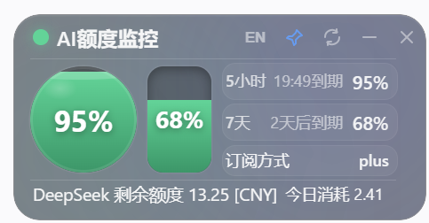
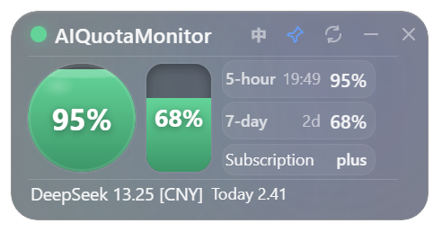

# AI Quota Monitor
<p align="center">
  
</p>
<p align="center">
  <strong>A lightweight tray dashboard for monitoring AI service quotas, balances, and usage.</strong>
</p>
<p align="center">
  <strong>一个轻量级桌面托盘工具，用于展示和统计各类 AI 服务的额度、余额与用量。</strong>
</p>
<p align="center">
  <a href="#中文说明">中文</a> ·
  <a href="#english">English</a> ·
  <a href="#credits">Credits</a>
</p>
---
# 中文说明
AI Quota Monitor 是一个 Windows 桌面悬浮小组件，用于显示本机 Codex 剩余额度与 DeepSeek 余额。
它采用透明液态玻璃质感界面，通过红、黄、绿三种 LED 状态，让你不用频繁打开命令行或页面，也能快速知道 Codex 额度是否快用完。
---
## ✨ 功能特点
- 🟢 **红绿灯额度状态**
  - 绿色：剩余额度大于等于 10%
  - 黄色：剩余额度小于 10%，但仍大于 0
  - 红色：剩余额度为 0
- 🤖 **DeepSeek 余额监控**
  - 实时显示 DeepSeek 账户剩余额度（CNY）
  - 自动统计**今日消耗**金额
  - 每日自动重置统计
  - 数据持久化存储，重启不丢失
- 🪟 **液态玻璃悬浮窗口**
  - 透明桌面小组件
  - 简洁、高颜值
  - 不遮挡正常开发工作
- 📌 **支持置顶**
  - 可以让小组件始终显示在其他窗口上方
  - 不需要时也可以取消置顶
- 🌐 **支持中文 / English 切换**
  - 内置双语界面
  - 中英文用户都可以使用
- 🔄 **自动刷新**
  - Codex 额度每 5 分钟自动刷新
  - DeepSeek 余额每 10 分钟自动刷新
  - 支持手动单独刷新
- 🔐 **隐私友好**
  - 使用本机已有的 Codex 登录状态
  - 不读取、不保存、不上传、不显示认证 Token
  - DeepSeek API Key 仅在本地使用
---
## 📸 截图预览
<p align="center">
  
  
## 🚀 下载
请前往 **Releases** 页面下载最新版 Windows `.exe` 文件：
👉 [前往 Releases 下载](https://github.com/sailoun601349/ai-quota-monitor/releases)
当前版本：`v2.0`
---
## 🖥️ 运行要求
- Windows 10 / Windows 11
- Codex 已安装并登录（用于 Codex 额度显示）
- DeepSeek API Key（可选，仅 DeepSeek 余额功能需要）
---
## 📦 DeepSeek 配置
DeepSeek 余额功能默认内置了 API Key。如需使用自己的 Key，有两种方式：
**方式一：环境变量（推荐）**
```bash
set DEEPSEEK_API_KEY=sk-your-key-here
```
**方式二：修改源码**
编辑 `src/main/deepseek-service.js` 中的 `DEFAULT_KEY` 值。
> 注意：DeepSeek API Key 仅本地使用，不会被上传或泄露。
---
## 📦 使用方法
1. 打开 [Releases](https://github.com/sailoun601349/ai-quota-monitor/releases) 页面。
2. 下载最新版本的 `.exe` 文件。
3. 确保电脑上已经安装并登录 Codex。
4. 双击运行 `.exe`。
5. 应用将在系统托盘运行，**不在任务栏显示**。
6. 点击托盘图标显示/隐藏窗口。
---
## 🔴 额度颜色说明
| 颜色 | 含义 |
|---|---|
| 🟢 绿色 | 剩余额度大于 30% |
| 🟡 黄色 | 剩余额度 10%~30% |
| 🔴 红色 | 剩余额度小于等于 10% |
额度状态会根据本机可读取到的 Codex 使用数据进行计算。
---
## 🔐 隐私说明
AI Quota Monitor 设计目标是本地化、轻量、隐私友好。
- 使用本机已有的 Codex 登录状态
- 不需要你手动输入 Token
- 不读取你的认证 Token
- 不保存你的认证 Token
- 不上传你的额度数据
- DeepSeek API Key 仅在你的电脑本地使用
- 数据保留在你的电脑本地
---
## 🛠️ 本地开发
克隆仓库：
```bash
git clone https://github.com/sailoun601349/ai-quota-monitor.git
cd ai-quota-monitor
```
安装依赖：
```bash
npm install
```
开发模式运行：
```bash
npm run dev
```
启动应用：
```bash
npm start
```
打包 Windows 便携版：
```bash
npm run build
```
打包完成后，生成文件会出现在 `dist` 文件夹中。
---
## 📁 项目结构
```txt
ai-quota-monitor/
├─ assets/            # 截图、图标和图片资源
├─ src/
│  ├─ main/
│  │  ├─ main.js              # Electron 主进程
│  │  ├─ preload.js           # 预加载脚本
│  │  ├─ quota-service.js     # Codex 额度查询服务
│  │  └─ deepseek-service.js  # DeepSeek 余额查询服务
│  └─ renderer/
│     ├─ index.html           # 界面 HTML
│     ├─ styles.css           # 液态玻璃样式
│     └─ renderer.js          # 前端逻辑
├─ package.json       # 项目配置和打包脚本
└─ README.md
```
---
## ❓ 常见问题
### 这个工具支持 macOS 或 Linux 吗？
目前主要面向 Windows 使用。
### 我需要手动输入 Codex Token 吗？
不需要。小组件会使用你本机已有的 Codex 登录状态，不需要你手动输入 Token。
### DeepSeek 今日消耗怎么计算的？
应用每天首次获取余额时记录为"当日初始值"。今日消耗 = 初始值 - 当前余额。次日自动重置。
### 为什么 Windows 会提示未知发布者？
因为当前应用还没有进行代码签名，所以 Windows 第一次运行时可能会显示安全提醒。
如果你确认文件来源可信，可以点击 **更多信息** → **仍要运行**。
### 它会上传我的使用数据吗？
不会。这个工具的目标是读取并显示本机额度状态，不上传你的额度数据。
---
## 🧩 技术栈
* Electron
* JavaScript
* HTML + CSS
* electron-builder
---
## 🗺️ 后续计划
* [ ] 支持自定义刷新间隔
* [ ] 增加开机自启动选项
* [ ] 增加更多小组件主题
* [ ] 增加手动刷新按钮（已完成 ✅）
* [ ] 优化 Codex 未登录时的提示
---
## 🤝 参与贡献
欢迎提交 Issue 和 Pull Request。
如果你发现 Bug、有功能建议，或者想改进界面，可以直接打开一个 Issue。
---
## 📄 开源协议
MIT License
---
<br />
# English
AI Quota Monitor is a small Windows desktop widget that shows your local Codex usage quota and DeepSeek balance.
It uses a transparent liquid-glass style interface and a simple red / yellow / green LED indicator, so you can quickly check whether your Codex quota is still available without repeatedly opening a terminal or checking manually.
---
## ✨ Features
* 🟢 **LED quota indicator**
  * Green: remaining quota is 10% or higher
  * Yellow: remaining quota is below 10% and above 0
  * Red: remaining quota is 0
* 🤖 **DeepSeek balance tracking**
  * Real-time DeepSeek account balance display
  * Daily spend tracking
  * Auto-resets each day
  * Persistent storage across restarts
* 🪟 **Liquid-glass desktop widget**
  * Transparent floating window
  * Clean and minimal visual style
  * Small enough to stay out of your way while coding
* 📌 **Always-on-top support**
  * Pin the widget above other windows
  * Unpin it whenever you do not need it
* 🌐 **Chinese / English interface**
  * Built-in language switch
  * Suitable for both Chinese and English users
* 🔄 **Auto-refresh**
  * Codex quota: every 5 minutes
  * DeepSeek balance: every 10 minutes
  * Manual refresh per service
* 🔐 **Privacy-friendly**
  * Uses your local Codex sign-in state
  * DeepSeek API key stays on your machine
  * No data uploaded
---
## 📸 Screenshots
<p align="center">
  
  
## 🚀 Download
Download the latest Windows `.exe` from the **Releases** page:
👉 [Download from Releases](https://github.com/sailoun601349/ai-quota-monitor/releases)

Current version: `v2.0`
---
## 🖥️ Requirements
* Windows 10 / Windows 11
* Codex installed and signed in on your computer
* DeepSeek API Key (optional, for balance feature only)
---
## 📦 How to Use
1. Go to the [Releases](https://github.com/sailoun601349/ai-quota-monitor/releases) page.
2. Download the latest `.exe` file.
3. Make sure Codex is installed and signed in on your computer.
4. Double-click the `.exe` to run the widget.
5. App runs in system tray (no taskbar entry).
6. Click tray icon to show/hide the widget.
---
## 🔴 Quota Status
| LED Color | Meaning                                  |
| --------- | ---------------------------------------- |
| 🟢 Green  | Remaining quota > 30%                    |
| 🟡 Yellow | Remaining quota 10%~30%                  |
| 🔴 Red    | Remaining quota ≤ 10%                    |
The remaining quota is calculated from Codex usage data available on your local machine.
---
## 🔐 Privacy
AI Quota Monitor is designed to be local and privacy-friendly.
* It uses your existing local Codex sign-in state.
* It does **not** ask you to enter a token.
* It does **not** read, save, upload, or display your authentication token.
* DeepSeek API Key is only used locally.
* Your data stays on your computer.
---
## 🛠️ Development
Clone the repository:
```bash
git clone https://github.com/sailoun601349/ai-quota-monitor.git
cd ai-quota-monitor
```
Install dependencies:
```bash
npm install
```
Run in development mode:
```bash
npm run dev
```
Start the app:
```bash
npm start
```
Build Windows portable executable:
```bash
npm run build
```
The output file will be generated in the `dist` folder.
---
## 📁 Project Structure
```txt
ai-quota-monitor/
├─ assets/            # Screenshots, icons and images
├─ src/
│  ├─ main/
│  │  ├─ main.js              # Electron main process
│  │  ├─ preload.js           # Preload script
│  │  ├─ quota-service.js     # Codex quota service
│  │  └─ deepseek-service.js  # DeepSeek balance service
│  └─ renderer/
│     ├─ index.html           # UI HTML
│     ├─ styles.css           # Liquid glass styles
│     └─ renderer.js          # UI logic
├─ package.json       # Project config and build scripts
└─ README.md
```
---
## ❓ FAQ
### Does this work on macOS or Linux?
Currently, this project is mainly built for Windows.
### Do I need to enter my Codex token?
No. The widget uses your existing local Codex sign-in state. You do not need to enter any token.
### How is daily DeepSeek spend calculated?
The app records the opening balance on first fetch each day. Daily spend = opening balance - current balance. Resets automatically the next day.
### Why does Windows show an unknown publisher warning?
The app is not code-signed yet, so Windows may show a warning when opening it for the first time.
You can click **More info** → **Run anyway** if you trust the downloaded file.
### Does it upload my usage data?
No. The widget is intended to read and display local quota status only.
---
## Credits
This project is based on [xicunwus2025-sys/ai-quota-monitor](https://github.com/xicunwus2025-sys/ai-quota-monitor) with enhancements.
### Additional Features
- DeepSeek balance monitoring (balance + daily spend)
- Custom application icon
- System tray only mode (no taskbar entry)
- Liquid glass UI refinements
- Smart expiry time display
- Window drag support
### Original Author
- Original project: [@xicunwus2025-sys](https://github.com/xicunwus2025-sys)
- Original repo: [ai-quota-monitor](https://github.com/xicunwus2025-sys/ai-quota-monitor)
---
## 🤝 Contributing
Issues and pull requests are welcome.
If you find a bug, have a feature request, or want to improve the UI, feel free to open an issue
---
## 📄 License
MIT License
